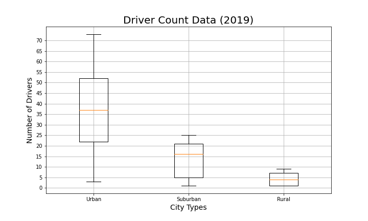

# PyBer_Analysis
#### Pyber is a ridesharing app company, where customers can request a driver to supply a ride to their chosen destination. 

## Overview
### This analyis of PyBer ride data will summarize the different ride share data by city type, will draw conclusions on trends noted, and will provide business recommendations to address any disparities in the data. 

## Results
### Per review of the rideshare data, results were noted as follows:

total rides, total drivers, total Fares, av fare per ride and driver , total fare by city type 
### Per review of the rideshare data, the total number of rides in Urban cities far outweighed those in Suburban and Rural.  Urban rideshares made up 68% of total rides as noted in the figure below.  

### The driver counts 

## Summary

### incentives for suburban and rural drivers 
### incentives for suburban and rural riders 
### partnering with local rural and suburban business to provide discounts to ride customers
