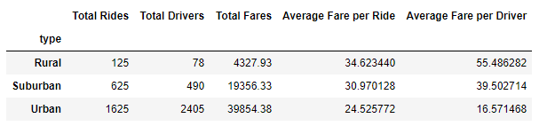
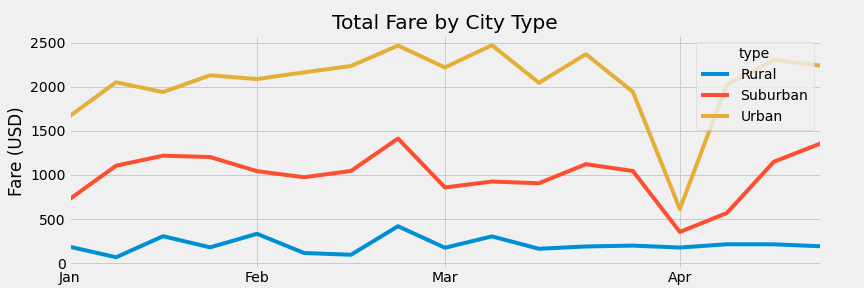

# PyBer_Analysis
#### Pyber is a ridesharing app company, where customers can request a driver to supply a ride to their chosen destination. 

## Overview
### This analyis of PyBer ride data will summarize the different ride share data by city type, will draw conclusions on trends noted, and will provide business recommendations to address any disparities in the data. 

## Results
### Per review of the rideshare data, results were noted as follows:

### The results in the figure above show that supply and demand for rides in Urban areas far outweighed those in Suburban and Rural.  This result is expected, as populations are greater and more dense in Urban areas.  The average fares per riders and drivers were higher as total rides and drivers decreased, as seen in the Rural areas.  

### The figure below shows the total fares by city type over the span of a four month period:    

## Summary

### Given that there is a clear lead in total rides, drivers, and fares in the Urban areas, it may be in PyBer's best interest to maintain their focus on the Urban regions.  However, if PyBer would like to increase business in the Suburban and rural areas three recommendations are: to incentivise drivers in Suburban and Rural areas, Incentivise riders in Suburban and Rural areas, and partner with business in Suburban and Rural areas that would likely have a need for rideshares.   
### Incentives for suburban and rural drivers would include a raise structure that would increase driver fares as more suburban and rural rides are completed.
### Incentives for suburban and rural riders would include ride discounts for rural and suburban rides.   
### Additionally, partnering with local rural and suburban business to provide rides for customers may increase traffic in rural and suburban areas.  Businesses to potentially partner with include include bars and car repair shops.  
